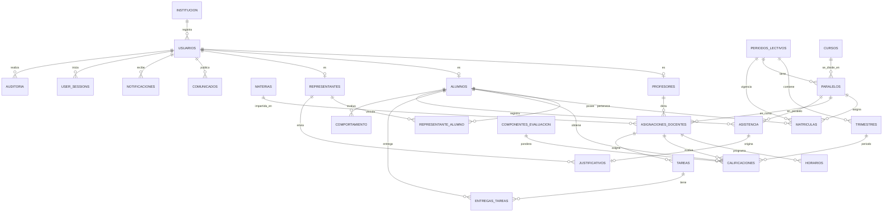

# Diagrama Entidad-Relación (ERD)

```mermaid
erDiagram
    INSTITUCION ||--o{ USUARIOS : registra
    USUARIOS ||--o| PROFESORES : es
    USUARIOS ||--o| ALUMNOS : es
    USUARIOS ||--o| REPRESENTANTES : es
    
    REPRESENTANTES ||--o{ REPRESENTANTE_ALUMNO : vincula
    ALUMNOS ||--o{ REPRESENTANTE_ALUMNO : pertenece
    
    PERIODOS_LECTIVOS ||--o{ TRIMESTRES : contiene
    PERIODOS_LECTIVOS ||--o{ PARALELOS : tiene
    CURSOS ||--o{ PARALELOS : se_divide_en
    
    ALUMNOS ||--o{ MATRICULAS : posee
    PARALELOS ||--o{ MATRICULAS : asigna
    PERIODOS_LECTIVOS ||--o{ MATRICULAS : vigencia
    
    PROFESORES ||--o{ ASIGNACIONES_DOCENTES : dicta
    MATERIAS ||--o{ ASIGNACIONES_DOCENTES : impartida_en
    PARALELOS ||--o{ ASIGNACIONES_DOCENTES : en_curso
    
    ASIGNACIONES_DOCENTES ||--o{ HORARIOS : programa
    ASIGNACIONES_DOCENTES ||--o{ CALIFICACIONES : evalua
    COMPONENTES_EVALUACION ||--o{ CALIFICACIONES : pondera
    TRIMESTRES ||--o{ CALIFICACIONES : periodo
    ALUMNOS ||--o{ CALIFICACIONES : obtiene
    
    ASIGNACIONES_DOCENTES ||--o{ TAREAS : asigna
    TAREAS ||--o{ ENTREGAS_TAREAS : tiene
    ALUMNOS ||--o{ ENTREGAS_TAREAS : entrega
    
    ALUMNOS ||--o{ ASISTENCIA : registra
    PARALELOS ||--o{ ASISTENCIA : en_paralelo
    ASISTENCIA ||--o| JUSTIFICATIVOS : origina
    REPRESENTANTES ||--o{ JUSTIFICATIVOS : envia
    
    ALUMNOS ||--o{ COMPORTAMIENTO : evalua
    USUARIOS ||--o{ COMUNICADOS : publica
    USUARIOS ||--o{ NOTIFICACIONES : recibe
    USUARIOS ||--o{ USER_SESSIONS : inicia
    USUARIOS ||--o{ AUDITORIA : realiza
```
