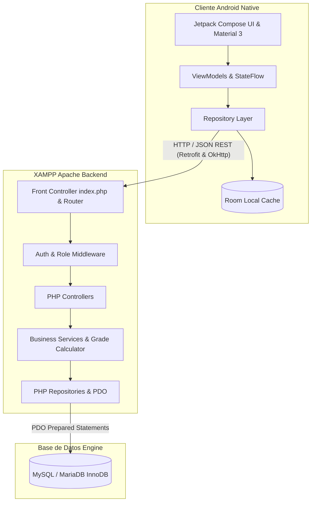
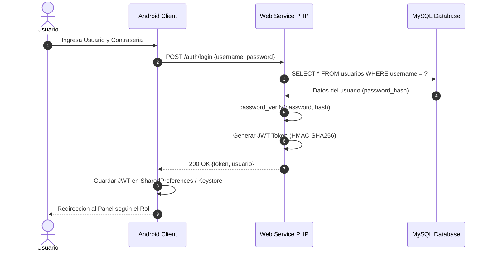

# Diagramas de Arquitectura y Diseño
**Unidad Educativa Dr. Alfredo Pareja Diezcanseco**

---

## 1. Diagrama de Arquitectura de Capas



---

## 2. Diagrama de Casos de Uso - Flujo de Justificativos

```mermaid
useCaseDiagram
    actor Representante as Rep
    actor Administrador as Admin
    
    usecase "Consultar Inasistencias" as UC1
    usecase "Enviar Justificativo con Evidencia" as UC2
    usecase "Revisar Justificativo Pendiente" as UC3
    usecase "Aprobar o Rechazar Justificativo" as UC4
    usecase "Actualizar Registro de Asistencia" as UC5
    
    Rep --> UC1
    Rep --> UC2
    Admin --> UC3
    Admin --> UC4
    UC4 ..> UC5 : <<includes>>
```

---

## 3. Diagrama de Secuencia - Proceso de Autenticación JWT


